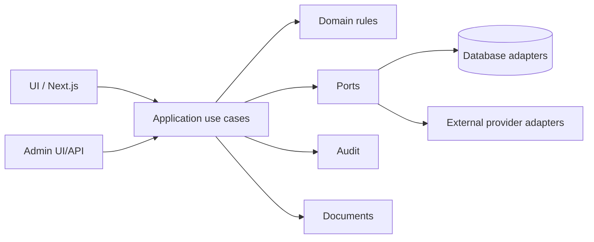

# Архитектура системы опросов

## Статус документа

Это целевая архитектура и фундамент, а не заявление о production-готовности. Реальные eGov, Digital ID, Астана-ЕРЦ, signing и object storage адаптеры отсутствуют.

## Аудит исходного проекта

### Стек и структура

- Next.js 16.3.1 App Router, React 19.2.8, TypeScript 5.9 в strict-режиме.
- Tailwind CSS 4 подключён, но основной интерфейс оформлен собственными CSS-файлами.
- Иконки — `lucide-react`; иных runtime-зависимостей нет.
- `/` и статически перечисленный catch-all отображают один крупный client component `SurveyApp`.
- Маршруты login/dashboard/archive/surveys реализованы через разбор URL и History API внутри браузера, а не отдельными серверными страницами.
- Backend, API routes, база, миграции, очереди, audit storage, роли администратора и тесты отсутствуют.

### Данные и сценарии

- `app/survey-data.ts` содержит три mock-опроса и два архивных листа.
- eGov/Digital ID/email — визуальная имитация; проверка выполняется таймерами.
- Лицевой счёт принимается только при значении `1911`; адрес и квартира жёстко заданы.
- Ответы, выбранный объект, подпись и факт отправки управлялись React/localStorage на клиенте.
- Подпись — PNG data URL из canvas. Это изображение росчерка, не электронная цифровая подпись.
- Лист голосования — HTML/CSS print-layout, а не неизменяемый серверный PDF. QR и идентификаторы демонстрационные.

### Что сохраняем

- одобренный UI, пользовательскую последовательность, адаптивную и печатную вёрстку;
- App Router, строгий TypeScript, PWA manifest и существующие mock-сценарии;
- canvas как возможный UX-ввод изображения, но не как механизм юридической подписи;
- текущие модели вопросов как исходный материал для будущей доменной модели.

### Что требуется заменить

- клиентскую авторизацию, проверку собственности, правила допуска и фиксацию голоса;
- localStorage как хранилище бизнес-состояния;
- клиентскую генерацию доказательств, номера документа, времени и результата;
- единый крупный UI-компонент — постепенно, без визуальной переписи;
- synthetic archive/QR/PDF на server-generated immutable documents;
- ручную маршрутизацию на защищённые серверные маршруты.

## Целевая декомпозиция



Зависимости направлены внутрь: domain не знает о Next.js, базе, cookies или внешних API. Application координирует use cases через интерфейсы. Infrastructure реализует порты. UI вызывает только server-side application boundary.

### Слои

- **UI:** server/client components, формы, доступность, локальные визуальные preferences.
- **Application:** begin/complete authentication, resolve property, create vote draft, sign, submit idempotently, retrieve archive.
- **Domain:** опрос, вопрос, право голоса, выбор, неизменяемое голосование, signing evidence, статусы.
- **Database:** sessions, users/subjects, properties snapshot, surveys/versions, votes, documents, audit events, idempotency records.
- **External integrations:** только адаптеры к нашим портам; vendor DTO не проходят в domain.
- **Authentication:** HttpOnly server session после подтверждения identity provider.
- **Property resolution:** серверная связь identity → account/property → eligibility snapshot.
- **Signing:** подпись digest канонического документа; верифицированное evidence сохраняется рядом с голосом.
- **Documents:** каноническая серверная генерация, hash, versioned immutable storage и проверяемая ссылка/QR.
- **Audit:** append-only события с request ID; аудит отделён от диагностических логов.
- **Admin:** отдельные роли и маршруты, four-eyes для критичных изменений, публикация versioned surveys.

## Добавленная структура

```text
src/
  domain/                    framework-independent types
  application/ports/        providers and repositories
  application/session/      trusted session service
  infrastructure/config/    fail-closed environment parsing
  infrastructure/logging/   structured redacted logging
  infrastructure/providers/ runtime, registry and mocks
  infrastructure/session/   development session adapter/cookie policy
```

Композиция находится в `src/infrastructure/composition-root.ts` и помечена `server-only`, поэтому провайдеры и секреты нельзя импортировать в client bundle.

## Транзакционная граница голосования

Production use case должен в одной серверной транзакции проверить активную session, версию опроса, eligibility snapshot, signing evidence и idempotency key; затем записать неизменяемый vote и audit event. Уведомления выполняются после commit через outbox. Клиент никогда не является источником истины для subject, property, timestamps или статуса подписи.
